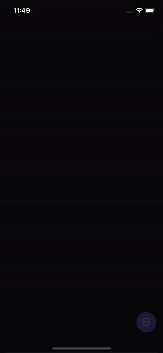

<h4 align="center">
    <h1 align="center">
      FeedGet - Mobile
    </h1>
</h4>

<h4 align="center">
    <p align="center">
      <a href="#-about">About</a>&nbsp;&nbsp;&nbsp;|&nbsp;&nbsp;&nbsp;
      <a href="#-technologies">Technologies</a>&nbsp;&nbsp;&nbsp;|&nbsp;&nbsp;&nbsp;
      <a href="#-how-to-run-the-project">Run</a>&nbsp;&nbsp;&nbsp;|&nbsp;&nbsp;&nbsp;
      <a href="#-info">Info</a>&nbsp;&nbsp;&nbsp;|&nbsp;&nbsp;&nbsp;
      <a href="#-changelog">Changelog</a>&nbsp;&nbsp;&nbsp;|&nbsp;&nbsp;&nbsp;
      <a href="#-license">License</a>
  </p>
</h4>

<h1 align="center">
  
</h1>

## 🔖 About

O feedget é um projeto desenvolvido durante a NLW #8 da Rocketseat, com o objetivo de criar um aplicativo mobile onde o usuário pode capturar uma screenshot da tela, escrever um comentário e enviar o feedback.

[Layout](<https://www.figma.com/file/3G82fbo73yeXHAUNn8QlEz/Feedback-Widget-(Community)?node-id=100%3A2114>)

## 🚀 Technologies

- [TypeScript](https://www.typescriptlang.org/)
- [React Native](https://reactnative.dev/)
- [Expo](https://expo.io/)

## 🏁 How to run the project

#### Clone the repository

```bash
git clone https://github.com/rafinhaa/feedget-mobile.git
cd feedget-mobile

# Install the dependencies
yarn install

# Start the application
expo start
```

## ℹ️ Info

## 📝 License

[MIT](LICENSE)

**Free Software, Hell Yeah!**
